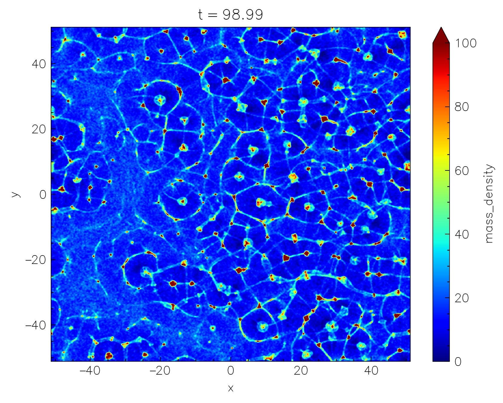
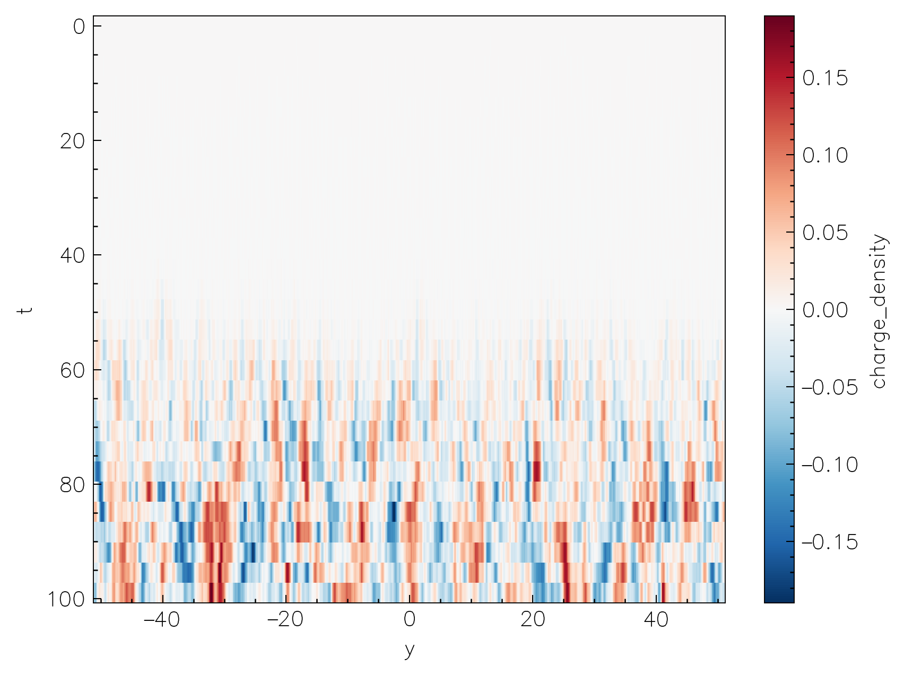

---
hide:
  - footer
---

# Output & visualization

To enable the runtime output of the simulation data, configure the code with the `-D output=ON` flag. As a backend `Entity` uses the open-source [ADIOS2](https://github.com/ornladios/ADIOS2) library compiled in-place. The output is written in the [HDF5](https://adios2.readthedocs.io/en/latest/engines/engines.html#hdf5) format, however, more formats will be added in the future. 

The output is configured using the following configurations in the `input` file:

```toml
[simulation]
# title used for the output filename
title   = "MySimulation"

# ...

[output]
# fields to write
fields     = ["Bx", "Ei", "Rho_1_2", ...]
# output format (current supported: "HDF5", or "disabled" for no output)
format     = "HDF5"
# interval between outputs (in the number of time steps)
interval   = 100
# smoothing stencil size for moments (in the number of cells) [defaults to 1]
mom_smooth = 2
```

Output is written in the run directory in a single `hdf5` file: `MySimulation.flds.h5` (at the moment only field output is supported). All the steps are written in the same file, and the time step is stored as an attribute of the dataset: `Step0`, `Step1`, `Step2`, etc. Thus to access, say, the `Ez` field at the 10th output step (not the same as the simulation timestep), one has to access the dataset `/Step9/Ez` in the `hdf5` file.

Following is the list of the supported fields:

| Field name | Description | Units |
|------------|-------------|------|
| `Ei` | Electric field (all components) | $B_0$ |
| `Bi` | Magnetic field (all components) |  $B_0$ |
| `Ji` | Current density (all components) | $q_0 n_0$ |
| `Rho` | Mass density | $m_0 n_0$ |
| `N` | Number density |  $n_0$ |
| `Tij` | Energy-momentum tensor (all components) | $m_0 n_0$ |

!!! note

    One can specify particular components to output. For instance, `E1` (or, e.g., `By`) will only output `Ex` (or, correspondigly, `By`). The same applies to the `Ji` and `Tij` fields. Additionally, `T0i` will output the `T00`, `T01`, and `T02` components, while `Tii` will output only the diagonal components: `T11`, `T22`, and `T33`. One can also specify the particle species which will be used to compute the moments: `Rho_1` (density of species 1), `N_2_3` (number density of species 2 and 3), `Tij_1_3` (energy-momentum tensor for species 1 and 3), etc. If no species are specified, the moments will be computed for all the species with $m_s \ne 0$.

All of the vector fields are interpolated to cell centers before the output, and converted to orthonormal basis. The particle-based moments are smoothed with a stencil (specified in the input file; `mom_smooth`) for each particle.

## `nt2.py`

To make the life easier, the `nt2.py` script is provided with the `Entity` source code in the `vis/` directory (the requirements are also provided in the `vis/requirements.txt`). `nt2.py` uses the [`dask`](https://docs.dask.org/en/stable/) and [`xarray`](https://docs.xarray.dev/en/stable/) libraries together with [`h5py`](https://pypi.org/project/h5py/) and [`h5pickle`](https://github.com/DaanVanVugt/h5pickle) to [lazily load](https://en.wikipedia.org/wiki/Lazy_loading) the output data and provide a convenient interface for the data analysis and quick visualization. 

To start using `nt2.py`, it is recommended to create a python virtual environment and install the required packages:

```shell
python3 -m venv .venv
source .venv/bin/activate # (1)!
pip install -r vis/requirements.txt # (2)!
```

1. Now all the packages will be installed in the `.venv` directory which you can remove at any time without affecting the system.
2. If you plan to use jupyter you might also need to run the following `pip install jupyterlab ipykernel`.

Now simply import the `nt2` module and load the output data:

```python
import nt2 # (1)!
flds = nt2.getFields("MySimulation.flds.h5")
```

1. If working outside the `vis/` directory you might need to add the `vis/` to your path: `import sys; sys.path.append("vis")` in order to import `nt2`.

Note, that even though the `h5` file can be quite large, the data is loaded lazily, so the memory consumption is minimal; data chunks are only loaded when they are actually needed for the analysis or visualization.

Data selection is conveniently done with the `sel` and `isel` methods for the `xarray` Datasets ([more info](https://docs.xarray.dev/en/stable/user-guide/indexing.html)). For example, to select the `mass_density` field around physical time `t=98`, one can do:

```python
flds.mass_density.sel(t=98, method="nearest") # (1)!
```

1. The `method="nearest"` is used to select the closest time step to the requested time.

{width=50%, align=right} 

We can then plot the selected data using the `plot` method of the `xarray` Dataset:

```python
flds.mass_density\
  .sel(t=98, method="nearest")\
  .plot(
    norm=mpl.colors.Normalize(0, 1e2),  # (2)!
    cmap="jet") # (1)!
```

1. The `norm` and `cmap` arguments are used to set the colorbar limits and the colormap just like in normal `matplotlib` context.
2. Make sure to also `module load matplotlib as mpl`.

If the resolution is too high, one can also coarsen the data before plotting:

```python
flds.Rho\
  .sel(t=98, method="nearest")\
  .coarsen(x=16, y=4).mean()\
  .plot(
    norm=mpl.colors.Normalize(0, 1e2),
    cmap="jet")
```

or downsample:

```python
flds.Rho\
  .sel(t=98, method="nearest")\
  .isel(x=slice(None, None, 16), y=slice(None, None, 4))\ # (1)!
  .plot(
    norm=mpl.colors.Normalize(0, 1e2),
    cmap="jet")
```

1. The difference between `isel` and `sel` is that `isel` uses the integer indices along the given dimension, while `sel` uses the physical coordinates.

{width=50%, align=right} 

One can also do more complicated things, such as building a 1D plot of the evolution of the mean $B^2$ in the box:

```python
flds.Bx**2 + flds.By**2 + flds.Bz**2\
  .mean(dim=["x", "y"])\
  .plot()
```

or make "waterfall" plots, collapsing the quantity along one of the axis, and plotting vs the other axis and time:

```python
flds.charge_density\
  .mean(dim="x")\
  .plot(yincrease=False)
```
