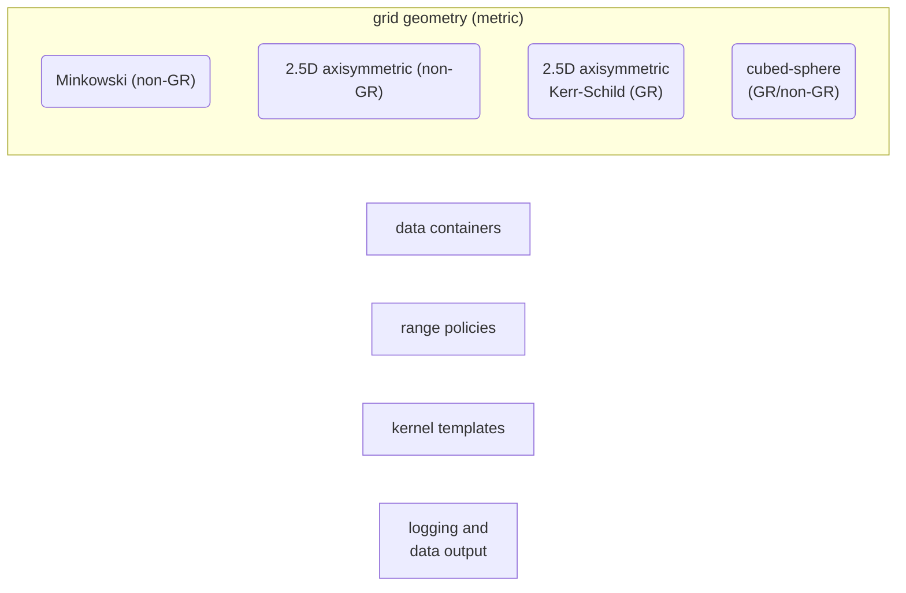
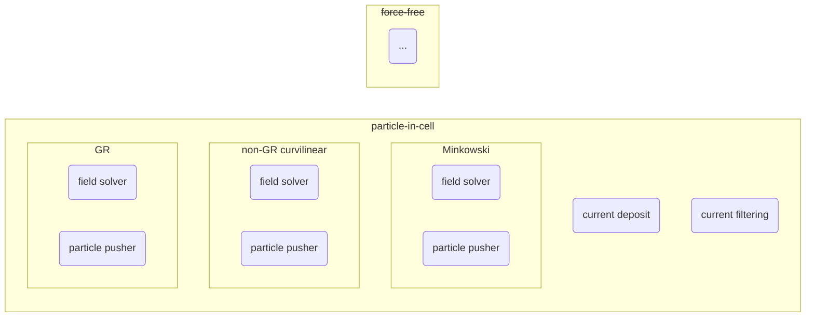

!!! warning

    This wiki page is under active construction and does not properly reflect the current development stage. If you are interested in working with us, please contact us at [haykh[dot]astro[at]gmail](mailto:haykh.astro+entity@gmail.com).

<div class="entity-cover"></div>

## `Entity`

`Entity` is a toolkit for astrophysical plasma simulations.[^1]

::cards::cols=3 image-bg

- title: Core framework
  content: |
    Provides predesigned low-level algorithm and data containers that can be adapted to particular physics routines and simulations at the higher level.
  image: "assets/icons/framework-icon.svg"
  url: ./
  key: core

- title: Simulation engines
  content: |
    Set of plasma physics simulation modules and algorithms for the high-energy astrophysical plasma simulations.
  image: "assets/icons/engine-icon.svg"
  url: ./
  key: sim

- title: Visualization tools
  content: |
    Runtime visualization, analysis and post-processing tools for the on-the-fly debugging, interactive data exploration and in-depth analysis. 
  image: "assets/icons/vis-icon.svg"
  url: ./
  key: vis

::/cards::

### Contributors

* :tea: Benjamin Crinquand {[@bcrinquand](https://github.com/bcrinquand): GR, cubed-sphere}
* :bubble_tea: Alisa Galishnikova {[@alisagk](https://github.com/alisagk): GR}
* :coffee: Hayk Hakobyan {[@haykh](https://github.com/haykh): framework, PIC, GR, cubed-sphere}
* :potato: Jens Mahlmann {[@jmahlmann](https://github.com/jmahlmann): cubed-sphere}
* :dolphin: Sasha Philippov {[@sashaph](https://github.com/sashaph): all-around}

### Timeline

::timeline::

- title: First public version
  content: v0.8 will include single-node PIC simulation engine in non-GR Cartesian, and curvilinear metrics, and the preliminary version of the on-the-fly visualization tool (nttiny).
  icon: v0.8
  sub_title: 2022-Dec
  key: v0-8
- title: GRPIC
  content: v0.9 will introduce the GRPIC engine with a spherical and quasi-spherical 2.5D Kerr-Schild metric.
  icon: v0.9
  sub_title: 2023-Feb
  key: v0-9
- title: First official release
  content: v1.0 will be the first official release of the Entity toolkit. It will fully support non-GR and GR PIC simulations on multiple nodes (GPU & CPU) in arbitrary geometries.
  icon: v1.0
  sub_title: 2023-Apr
  key: v1-0
- title: Advanced features
  content: TBD (cubed-sphere, QED, force-free, etc.).
  icon: v1.1
  sub_title: 2023-Jun
  key: v1-1

::/timeline::

[^1]: [Icons](https://game-icons.net/) are used under the [CC BY 3.0 license](https://creativecommons.org/licenses/by/3.0/); created by [Delapouite](https://delapouite.com/), and [Lorc](https://lorcblog.blogspot.com/).

<!-- 
### Core framework



Simulation engines



Visualization toolkit

```mermaid
flowchart LR
  nttiny([nttiny])
  graphet(["graph-et"])
``` -->
